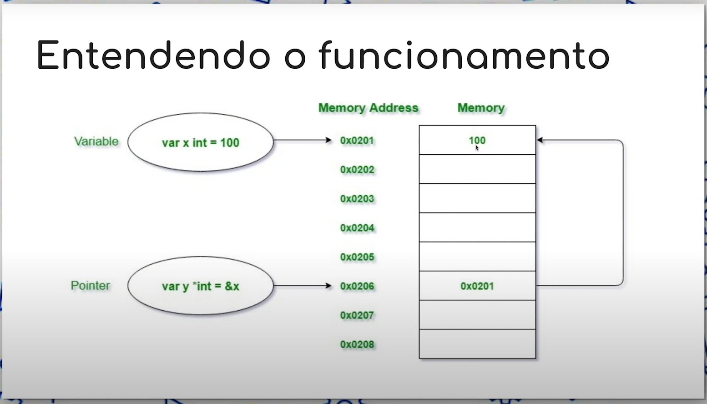

# 5: Introdução à ponteiros em Go

- passar valores entre funções sem ponteiros, cria uma cópia
- todos os "cantos" do código acessar o mesmo valor da variável, se utilizar ponteiro

## O que são pontieros em go?
- Ponteiro é uma variável usada para armazenar o endereço de memória de outra variável
- Ponteiros em Golang também são chamados de variáveis especiais
- Variáveis são usadas para armazenar alguns dados em um endereço de memória específico no sistema
- O endereço de memória é sempre encontrado na forma hexadecimal(começando com 0x como 0xFFAFF etc)

## Os operadoes * e & 
- Em go um ponteiro é representado usando o carectere * (asterisco) seguido pelo tipo do valor armazenado
- ***Também é usado para "desreferenciar" variáveis de ponteiro**
- Cancelar a referência de um ponteiro nos dá acesso ao valor para o qual o ponteiro aponta
- Quando escrevemos *xptr = 0, estamos dizendo "armazene o int 0 no local de memória a que xptr se refere
- Se tentarmos xptr = 0, obteremos um erro do compilador porque xptr não é um int, é um *int, que só pode receber outro *int 
- **Usamos o operador & para encontrar o endereço de uma variável**
- &x retorna um *int(ponteiro para um int) porque x é um int. Isso é o que nos permite modificar a variável original.
- &x em principal e xptr em zero referem-se ao mesmo local de memória

## Entendendo o funcionamento



```go
package main

import (
	"fmt"
)

func main() {

	x := 100
	y := &x
	x++

	fmt.Println(x, *y)

	testValue := "Otávio"
	copyStringVALUE(testValue)
	fmt.Println(testValue)

	originalStringValue(&testValue)
	fmt.Println(testValue)

}

func copyStringVALUE(stringValue string) {
	stringValue = "TEST"
	fmt.Println(stringValue)
}

func originalStringValue(stringValue *string) {
	*stringValue = "TEST"
	fmt.Println(*stringValue)
}
```

